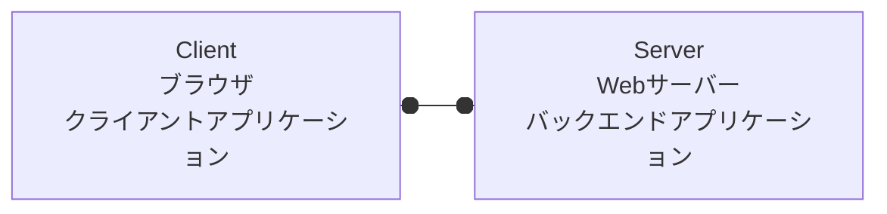

# WebAPI

## Webアプリケーションの構成



## WebAPI

- API (Applicaiton Programming Interface)

  アプリケーションを作るときに使うデータの出入り口のこと。

- WebAPI

  インターネントにあるサービスを利用するためのAPI

## 主なデータ形式

- JSON

  ```json
  {
    "year": 2022,
    "month" : "april",
  }
  ```

- YAML

  ```yaml
  request:
    year: 2022
    month: april
  ```

- XML

  ```xml
  <xml>
    <year>2022</year>
    <month>april</month>
  </xml>
  ```

## クライアントAPI

- [XMLHttpRequest](https://developer.mozilla.org/ja/docs/Web/API/XMLHttpRequest)
- [Fetch API](https://developer.mozilla.org/ja/docs/Web/API/Fetch_API)
- [WebSocket API](https://developer.mozilla.org/ja/docs/Web/API/WebSockets_API)
- [WebRTC API](https://developer.mozilla.org/ja/docs/Web/API/WebRTC_API)

## HTTPリクエストを利用した通信技術

- REST API (RESTful API)
- RPC (JSON-RPC)
- SOAP
- JSONP
- GraphQL
