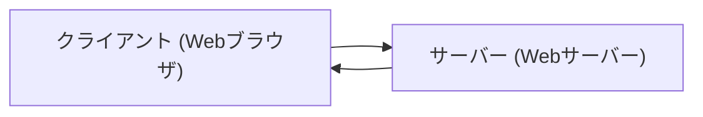

# WebAPI

## Webアプリケーションの構成



## ネットワーク技術

### OSI参照モデル

| レイヤ | 名称                 | 概要                                   |
| ------ | -------------------- | -------------------------------------- |
| 7      | アプリケーション層   | 具体的な通信サービスを行うための定義   |
| 6      | プレゼンテーション層 | データの表現形式を定義する             |
| 5      | セッション層         | 通信の手順を定義する                   |
| 4      | トランスポート層     | 端末同士の通信方法を定義する           |
| 3      | ネットワーク層       | 通信経路の選択を行う                   |
| 2      | データリンク層       | 通信機器の接続を定義                   |
| 1      | 物理層               | 物理的な接続、電波、電気、ケーブルなど |

### インターネット プロトコル スイート

| レイヤ | 名称               | 概要                                                             |
| ------ | ------------------ | ---------------------------------------------------------------- |
| 4      | アプリケーション層 | DNS、TLS/SSL、HTTP、POP3、SMTP、SNMP、SSH、TELNET、FTP、IMAPなど |
| 3      | トランスポート層   | TCP、UDP、SCTPなど                                               |
| 2      | インターネット層   | IPv4、IPv6、ARP                                                  |
| 1      | リンク層           | イーサネット、Wi-Fi、PPP、FDDIなど                               |

### IP(インターネットプロトコル)

ネットワーク層/インターネット層のプロトコル

- IPv4
  - IPアドレス
  - サブネットマスク
  - ユニキャスト、マルチキャスト、ブロードキャスト
- IPv6
  - IPアドレス
  - ユニキャスト、マルチキャスト、エニーキャスト

### TCP/IP と UDP/IP

トランスポート層のプロトコル

- TCP (Transmission Control Protocol / トランスミッションコントロールプロトコル)
  - ハンドシェイク : 必要
  - 再送やタイムアウトの制御 : あり
  - データの順序性の制御 : あり
  - データサイズの制限 : なし
- UDP (User Datagram Protocol / ユーザーデータグラムプロトコル)
  - ハンドシェイク : 不要
  - 再送やタイムアウトの制御 : なし
  - データの順序性の制御 : なし
  - データサイズの制限 : あり

### ネットワークエンジニアの資格

- [CCNA](https://www.cisco.com/c/dam/global/ja_jp/training-events/training-certifications/exam-topics/200-301-CCNA.pdf)
- [CCNP](https://www.cisco.com/c/dam/global/ja_jp/training-events/training-certifications/exam-topics/350-401-ENCOR.pdf)

- [パケットトレーサー](https://www.netacad.com/ja/courses/packet-tracer)

## WebAPI

- API (Applicaiton Programming Interface)

  アプリケーションを作るときに使うデータの出入り口のこと。

- WebAPI

  インターネントにあるサービスを利用するためのAPI

## 主なデータ形式

- JSON

  ```json
  {
    "year": 2022,
    "month" : "april",
  }
  ```

- YAML

  ```yaml
  request:
    year: 2022
    month: april
  ```

- XML

  ```xml
  <xml>
    <year>2022</year>
    <month>april</month>
  </xml>
  ```

## クライアントAPI

- [XMLHttpRequest](https://developer.mozilla.org/ja/docs/Web/API/XMLHttpRequest)
- [Fetch API](https://developer.mozilla.org/ja/docs/Web/API/Fetch_API)
- [WebSocket API](https://developer.mozilla.org/ja/docs/Web/API/WebSockets_API)
- [WebRTC API](https://developer.mozilla.org/ja/docs/Web/API/WebRTC_API)

## HTTPリクエストを利用した通信技術

- REST API (RESTful API)
- RPC (JSON-RPC)
- SOAP
- JSONP
- GraphQL
