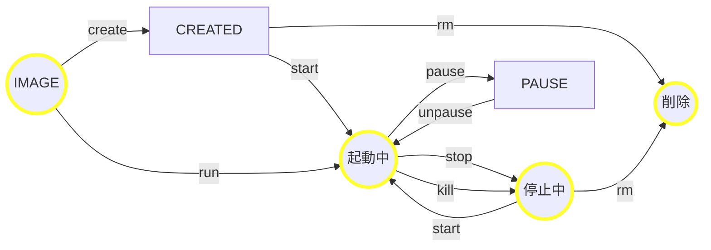
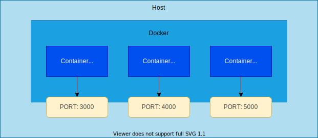

# コンテナ技術


## コンテナとは？

仮想的な１台のコンピュータのこと

物理的な１台のコンピュータで仮想的な複数台のコンピュータを動かせる。コンテナは隔離されていてメモリやファイル、ポートが別扱いになる。そのため、ファイルを変更したりポートを使用しても他のコンテナに影響しない。

- 参考：[コンテナ技術と仮想マシンの違いとは？](https://psc-smartwork.com/topics/2021/08/162.html#:~:text=%E3%82%B3%E3%83%B3%E3%83%86%E3%83%8A%E3%81%A8%E3%81%AF%E3%80%81%E3%82%A2%E3%83%97%E3%83%AA%E3%82%B1%E3%83%BC%E3%82%B7%E3%83%A7%E3%83%B3%E3%81%A8,%E3%81%AA%E7%92%B0%E5%A2%83%E3%82%92%E4%BD%9C%E3%82%8A%E5%87%BA%E3%81%97%E3%81%BE%E3%81%99%E3%80%82)

# Docker

Docker はコンテナ技術のデファクトスタンダード(事実上の標準)。

- [docker](https://www.docker.com/)
- [docker docs](https://docs.docker.com/)
- [docker 日本語](https://docs.docker.jp/)

## コンテナのライフサイクル



## コンテナの起動

run コマンドで [Hello World](https://hub.docker.com/_/hello-world) イメージを実行する。

```bash
$ docker run hello-world

Hello from Docker!
This message shows that your installation appears to be working correctly.

To generate this message, Docker took the following steps:
 1. The Docker client contacted the Docker daemon.
 2. The Docker daemon pulled the "hello-world" image from the Docker Hub.
    (arm64v8)
 3. The Docker daemon created a new container from that image which runs the
    executable that produces the output you are currently reading.
 4. The Docker daemon streamed that output to the Docker client, which sent it
    to your terminal.

To try something more ambitious, you can run an Ubuntu container with:
 $ docker run -it ubuntu bash

Share images, automate workflows, and more with a free Docker ID:
 https://hub.docker.com/

For more examples and ideas, visit:
 https://docs.docker.com/get-started/

$
```

実行するたびにコンテナがSTOP状態で残る。

```bash
$ docker ps -a          
CONTAINER ID   IMAGE                            COMMAND                  CREATED              STATUS                          PORTS     NAMES
efc3f1949ceb   hello-world                      "/hello"                 2 seconds ago        Exited (0) 2 seconds ago                  peaceful_rosalind
f3200b3ceaad   hello-world                      "/hello"                 53 seconds ago       Exited (0) 53 seconds ago                 clever_greider
2ee86b49bd14   hello-world                      "/hello"                 About a minute ago   Exited (0) About a minute ago             quizzical_moore
```

rm コマンドでコンテナIDを指定して、コンテナを削除できる。

```bash
$ docker rm efc3f1949ceb
efc3f1949ceb
$ docker ps -a
CONTAINER ID   IMAGE                            COMMAND                  CREATED         STATUS                     PORTS     NAMES
f3200b3ceaad   hello-world                      "/hello"                 3 minutes ago   Exited (0) 3 minutes ago             clever_greider
2ee86b49bd14   hello-world                      "/hello"                 4 minutes ago   Exited (0) 4 minutes ago             quizzical_moore
```

--rm フラッグをつけると終了すると自動的に削除される。

```bash
$ docker run --rm hello-world
```

## インタラクティブモードで実行

```bash
$ docker run -it --rm node:14-alpine
Welcome to Node.js v14.20.0.
Type ".help" for more information.
> .exit
$ 
```

```bash
$ docker run -it --rm node:14-alpine /bin/sh
/ # exit
$ 
```

## イメージのビルド

変更のあったファイルを保存しておいて後で利用できる。

参考：[Create a simple parent image using scratch](https://docs.docker.com/develop/develop-images/baseimages/#create-a-simple-parent-image-using-scratch)

### hello 実行ファイルのビルド

hello.c ファイルを作成する。

```c
#include <stdio.h>

int main()
{
  printf("Hello World Docker!!\n");
  return 0;
}
```

hello.c を linux 環境で動作するように docker を使ってビルドする。

```bash
$ docker run --rm -it -v $PWD:/build ubuntu:20.04
root@dXXXXXXXXXXX:/# apt-get update && apt-get install build-essential
root@dXXXXXXXXXXX:/#  cd /build
root@dXXXXXXXXXXX:/build# gcc -o hello -static hello.c
root@dXXXXXXXXXXX:/build# ./hello
Hello World Docker!!
root@dXXXXXXXXXXX:/build# exit
$
```

### hello イメージのビルド

Dockerfile を作成する。

```dockerfile
FROM scratch
ADD hello /
CMD ["/hello"]
```

hello という名前のイメージを作成する。

```bash
$ docker build --tag hello .
```

hello イメージを実行する。

```bash
$ docker run --rm hello
Hello World Docker!!
```

## ホストとコンテナ

### PORT

コンテナのポートをホストの別のポートで公開できる。



```bash
$ docker --rm -p 3000:8080 simple-server
```

### Reactアプリをビルドして動かす

2-CONTAINER/hello-react-app に移動して以下のコマンドを実行する。

```bash
$ docker build --tag hello-react-app .
$ docker run --rm -p 3000:8080 hello-react-app
```

ブラウザで [http://localhost:3000](http://localhost:3000) を開く。

イメージを削除して後片付けする。

```bash
$ docker rmi hello-react-app
```

## コンテナ間で通信する

Docker ネットワークを作成する。

```bash
$ docker network create my-network
$ docker network ls               
NETWORK ID     NAME                      DRIVER    SCOPE
c80efeec6468   bridge                    bridge    local
4891d209e02a   host                      host      local
da29701a16b0   my-network                bridge    local
```

Docker ネットワークの詳細を調べる。

```bash
$ docker network inspect my-network
[
    {
        "Name": "my-network",
              :
```

Docker ネットワークを指定してコンテナを起動する。

```bash
$ docker run --rm --name react-app --network my-network hello-react-app
```

別のターミナルで curlimages/curl を起動する。

```bash
$ docker run -it --rm --name shell --network my-network curlimages/curl /bin/sh
```

hello-react-app を curl してみる。ネットワークを作成すると Docker 内 DNS が機能するため、react-app で接続できる。

```bash
/ $ curl http://react-app:8080/hello.txt
Hello World from Hello React App
```

## ボリューム

Docker には３種類のボリュームがある。

参考：[ボリュームの利用](https://matsuand.github.io/docs.docker.jp.onthefly/storage/volumes/)

### 1. 名前付きボリューム / 匿名ボリューム

Docker 管理下のストレージ領域。
ボリュームに名前をつけるとコンテナを終了しても消えない。匿名ボリュームはコンテナの削除と共に消える。
以下のコマンドでは my-storage という名前のボリュームを /work ディレクトリにマウントしている。

```bash
$ docker run -it --rm -v my-storage:/work ubuntu
```

コンテナ内で以下のコマンドで /work ディレクトリに hello.txt を作成する。

```text
/# echo "Hello World" >> /work/hello.txt
```

別のターミナルから以下のコマンドを実行すると作成した hello.txt の中身を見ることができる。

```bash
$ docker run --rm -v my-storage:/work ubuntu cat /work/hello.txt
Hello World
```

作成したボリュームを確認するには以下のコマンドを実行する。

```bash
$ docker volume ls
DRIVER    VOLUME NAME
local     my-storage
```

手動でボリュームを作成する場合は以下のコマンドを用いる。

```bash
$ docker volume create my-storage
```

### 2. バインドマウント

ホストのディレクトリをコンテナ内のディレクトリと共有する。以下のコマンドではホストのカレントディレクトリをコンテナの /work にマウントしている。

```bash
$ docker run -it --rm -v ${PWD}:/work ubuntu /bin/bash
```

### 3. tmpfs

メモリ内に作られるストレージ。コンテナが終了すると消える。

```bash
$ docker run -it --rm --tmpfs /my-tmp ubuntu /bin/bash
```

## ENTRYPOINT と CMD

ENTORYPOINT は必ず実行し、CMD はオプションで未指定ならオプションとして使用される。

参考：[ENTRYPOINTは「必ず実行」、CMDは「（デフォルトの）引数」](https://pocketstudio.net/2020/01/31/cmd-and-entrypoint/)

Dockerfile を作成してイメージをビルドする。

```dockerfile
FROM ubuntu:20.04
ENTRYPOINT ["echo"]
CMD ["Hello World"]
```

```bash
$ docker image build -t hello-echo .
```

引数がなければ「Hello World」

```bash
$ docker container run hello-echo
Hello World
```

引数があれば「Test World」

```bash
$ docker container run hello-echo "Test World"
Test World
```

### ADD と COPY

- ADD
  - リモートからファイルコピーできる
  - 圧縮ファイルを指定すると解凍して展開される
- COPY
  - リモートからファイルコピーはできない
  - 圧縮ファイルは圧縮ファイルままコピーされる

参考：[Dockerfile の ADD と COPY の違いを結論から書く](https://qiita.com/YumaInaura/items/1647e509f83462a37494)

次の Dockerfile を使用して sample.tar.gz ファイルを /work に展開したイメージを作成する。

```dockerfile
FROM ubuntu:20.04
ADD sample.tar.gz /work
CMD ["bash"]
```

カレントディレクトリを 2-CONTAINER/add-copy にして、以下のコマンドで sample ディレクトリを圧縮する。

```bash
$ docker run -it --rm -v ${PWD}:/work -w /work  ubuntu /usr/bin/tar cfvz sample.tar.gz sample
sample/
sample/hello.txt
$ 
```

カレントディレクトリに sample.tar.gz ファイルができる。

```bash
$ ls
Dockerfile      sample          sample.tar.gz
```

以下のコマンドでイメージをビルドする。

```bash
$ docker build --tag add-copy-sample .
```

ビルドしたイメージに hello.txt が含まれているか、次のコマンドで確かめる。

```bash
$ docker run -it --rm add-copy-sample ls /work/sample
hello.txt
```

参考：[Dockerfile reference](https://docs.docker.com/engine/reference/builder/)

#　CI/CD

## GitLab vs GitHub

- [GitLab](https://about.gitlab.com/)
- [GitLab vs GitHub](https://about.gitlab.com/devops-tools/github-vs-gitlab/)

## CI/CD pipelines

パイプラインはソースをリモートリポジトリにプッシュしたあと、指定したジョブが実行される。
主に、ビルド、テスト、デプロイを行う。

GitLab では .gitlab-ci.yml ファイルをリポジトリのルートに配置するとパイプラインが走る。
以下の例では、step1 と step2、step3 の３つのステージがあり、３つのジョブが走る。

```yaml
stages:
  - step1
  - step2
  - step3

job1:
  stage: step1
  script:
    - "echo step1"
    - "pwd"
    - "ls"
    - ". hello.sh"

job2:
  stage: step2
  script:
    - "echo step2"
    - "pwd"
    - "ls"
    - ". hello.sh"

job3:
  stage: step3
  script:
    - "echo step3"
    - "pwd"
    - "ls"
    - ". hello.sh"
```

GitLab の [Runner executor](https://docs.gitlab.com/runner/executors/index.html) として以下のものがある。

- SSH
- Shell
- Parallels
- VirtualBox
- Docker
- Docker Machine (auto-scaling)
- Kubernetes
- Custom

# Docker Compose

[Docker Compose](https://docs.docker.com/compose/) は複数のコンテナを束ねて管理するツールである。下記は Docker Compose の YAML ファイルの例。

```yaml
services:
  web:
    build: .
    ports:
      - "8000:5000"
    volumes:
      - .:/code
      - logvolume01:/var/log
    depends_on:
      - redis
  redis:
    image: redis
volumes:
  logvolume01: {}
```

## Docker Compose を使用しない場合

ターミナルを２つ開き、一方のカレントディレクトリを 2-CONTAINER/compose-lab/app、もう一方を 2-CONTAINER/compose-lab/web にする。

それぞれ、hello-app、hello-web のタグでビルドする。

```bash
# 2-CONTAINER/compose-lab/app で実行
$ docker image build -t hello-app .
```

```bash
# 2-CONTAINER/compose-lab/web で実行
$ docker image build -t hello-web .
```

hello-web と hello-app を起動する。

```bash
# 2-CONTAINER/compose-lab/app で実行
$ docker run -it --rm --name hello-app --network my-network -e MESSAGE="hello docker" -p 4000:3000 hello-app
```

```bash
# 2-CONTAINER/compose-lab/web で実行
$ docker run -it --rm --name hello-web --network my-network -e HELLO=http://hello-app:3000/hello -p 3000:3000 hello-web
```

ターミナルをもう一つ開き、以下のコマンドを実行し、動作確認する。

```bash
$ curl http://localhost:3000/hello
{"message":"hello docker"}
```

## Docker Compose を使用する場合

2-CONTAINER/compose-lab をカレントディレクトリにして以下のコマンドを実行。

```bash
$ docker-compose up
```

ターミナルをもう一つ開き、以下のコマンドを実行し、動作確認する。

```bash
$ curl http://localhost:3000/hello
{"message":"hello from docker compose"}
```

# Kubernetes

[Kubernetesとは何か？](https://kubernetes.io/ja/docs/concepts/overview/what-is-kubernetes/)

## Hello アプリを minikube クラスターで稼働させる。

[Hello World アプリをデプロイする](https://kubernetes.io/ja/docs/tasks/access-application-cluster/ingress-minikube/)

ローカルの Docker に minikube クラスターを作成する。

```bash
$ minikube start
```

ダッシュボードを有効化する。

```bash
$ minikube dashboard
```

hello-app を稼働させる。

```bash
$ kubectl create deployment hello --image=gcr.io/google-samples/hello-app:1.0
deployment.apps/hello created
```

Deploymentを NodePort で公開する。

```bash
$ kubectl expose deployment hello --type=NodePort --port=8080
service/hello exposed
```

稼働状況を調べる。

```bash
$ kubectl get pods      
NAME                     READY   STATUS    RESTARTS   AGE
hello-7cc4ddd5f6-bpzpp   1/1     Running   0          2m1s
$ kubectl get services hello
NAME    TYPE       CLUSTER-IP     EXTERNAL-IP   PORT(S)          AGE
hello   NodePort   10.102.21.15   <none>        8080:32004/TCP   12s
```

minikube にアプリとアクセスするためのトンネルを作成する。

```bash
$ minikube service hello
```

CTL+C で停止し、サービスを削除する。

```bash
$ kubectl delete service hello
```

ingress アドオンを有効化する。

```bash
$ minikube addons enable ingress
```

Deploymentを LoadBalancer で公開する。

```bash
$ kubectl expose deployment hello --type=LoadBalancer --port=8080
```

minikube にアプリとアクセスするためのトンネルを作成する。

```bash
$ minikube tunnel
```

minikube を終了させる。

```bash
$ minikube stop
$ minikube delete
```

## Kubernetesの基本モジュール

[Kubernetesの基本モジュール](https://kubernetes.io/ja/docs/tutorials/kubernetes-basics/)

- クラスター
- マスター
- ノード
- コントロールプレーン
- デプロイメント
- ポッド
- サービス

## LoadBalancer と NodePort の違い

NodePort は 個別の Node にアクセスする場合に使用する。LoadBalancer は複数の Node に振り分けする場合に使用する。

参考：[【Kubernetes】NodePortとLoadBalancerの違い](https://www.mtioutput.com/entry/kube-what-lb)

## クラスタ内の通信相手の特定

通信相手の特定は環境変数と DNSを使用する。

```bash
/ # env | sort
HELLO2_PORT=tcp://10.106.127.237:8080
HELLO2_PORT_8080_TCP=tcp://10.106.127.237:8080
HELLO2_PORT_8080_TCP_ADDR=10.106.127.237
HELLO2_PORT_8080_TCP_PORT=8080
HELLO2_PORT_8080_TCP_PROTO=tcp
HELLO2_SERVICE_HOST=10.106.127.237
HELLO2_SERVICE_PORT=8080
```

```bash
wget -q -O - http://hello2.default.svc.cluster.local:8080
```

## YAML ファイルで Pod 作成

```yaml
apiVersion: apps/v1
kind: Deployment
metadata:
  name: hello
  labels:
    app: hello
spec:
  replicas: 3
  selector:
    matchLabels:
      app: hello
  template:
    metadata:
      labels:
        app: hello
    spec:
      containers:
      - name: hello
        image: gcr.io/google-samples/hello-app:1.0
        ports:
        - containerPort: 8080
```

```bash
kubectl apply -f hello-deployment.yaml
```

参考：[Kubernetes API](https://kubernetes.io/docs/reference/kubernetes-api/)

## ローカルで作成したイメージを使用する

[Kubernetes 入門 - 自作の Docker イメージを minikube で動かす方法](https://tech.andpad.co.jp/entry/2021/02/18/170000)

一時的に docker の向き先を minikube に変更する

```bash
eval $(minikube -p minikube docker-env)
```

Dockerfile を作成する

```text
FROM node:16-alpine
WORKDIR /app

COPY package*.json ./
RUN yarn install

COPY . .
RUN yarn run build

ENV HOST 0.0.0.0
EXPOSE 3000

CMD ["yarn", "run", "start"]
```

ビルドしたイメージは minikube 内の Docker に保存される。

```bash
docker build -t sample-react-app:minikube .
```
