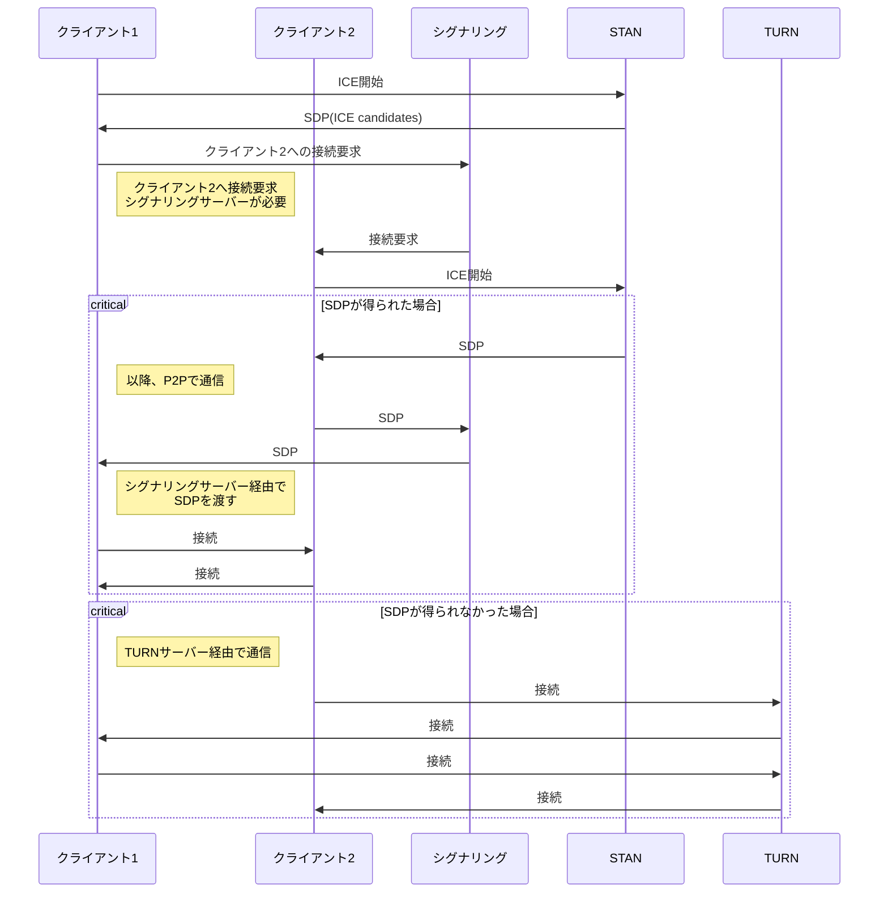

# P2P（ピアツーピア)

## ネットワーク形態



## [UDPホールパンチング](https://ja.wikipedia.org/wiki/UDP%E3%83%9B%E3%83%BC%E3%83%AB%E3%83%91%E3%83%B3%E3%83%81%E3%83%B3%E3%82%B0)

P2P通信を行うための[NAT](https://www.infraexpert.com/study/ip10.html)に穴を開ける処理のこと。
IPで相手と通信するためには、相手のIPアドレスが必要。通常、クライアントはLAN(NATの内側)の中にいるため、直接通信できない。



NATはサーバーからのレスポンスを受け入れるために、一定時間、特定のポートとクライアントを紐づけて覚えている。クライアントと繋がっているNATのIPアドレスとポートが分かれば外部から接続できる。

## [WebRTC](https://ja.wikipedia.org/wiki/WebRTC)

ブラウザでリアルタイム通信を行うためのP2P通信API。WebRTCを使用すればブラウザ同士が直接通信することができる。WebRTCはいくつかの技術が組み合わされて実現されている。

- [SDP](https://developer.mozilla.org/ja/docs/Web/API/WebRTC_API/Connectivity#%E3%82%BB%E3%83%83%E3%82%B7%E3%83%A7%E3%83%B3%E3%83%87%E3%82%A3%E3%82%B9%E3%82%AF%E3%83%AA%E3%83%97%E3%82%B7%E3%83%A7%E3%83%B3)

  P2P 通信を確立するための情報([セッションディスクリプション](https://developer.mozilla.org/ja/docs/Web/API/WebRTC_API/Connectivity#%E3%82%BB%E3%83%83%E3%82%B7%E3%83%A7%E3%83%B3%E3%83%87%E3%82%A3%E3%82%B9%E3%82%AF%E3%83%AA%E3%83%97%E3%82%B7%E3%83%A7%E3%83%B3))をやり取りするプロトコル

- [シグナリング](https://developer.mozilla.org/ja/docs/Web/API/WebRTC_API/Connectivity#%E3%82%B7%E3%82%B0%E3%83%8A%E3%83%AA%E3%83%B3%E3%82%B0)

  P2Pを確立するための情報を交換する

- SRTP 
  
  セキュアなオーディオ・ビデオ用通信プロトコル

- SCTP over DTLS

  データ通信に利用するプロトコル

P2P通信するためにはICEが必要。STANサーバーへ接続してICEを得る。



[手動でWebRTCの通信をつなげよう ーWebRTC入門2016](https://html5experts.jp/mganeko/19814/)

[WebRTC プロトコル入門](https://developer.mozilla.org/ja/docs/Web/API/WebRTC_API/Protocols)

[WebRTC 接続](https://developer.mozilla.org/ja/docs/Web/API/WebRTC_API/Connectivity)

[panda's tech note WebRTC](https://ja.tech.jar.jp/webrtc/basics.html)

[WebRTC コトハジメ](https://gist.github.com/voluntas/67e5a26915751226fdcf)

# ブロックチェーン

- [Bitcoin: A Peer-to-Peer Electronic Cash System](https://bitcoin.org/bitcoin.pdf)

  中央機関が存在しないP2Pネットワーク上で、合意形成を行うことを可能にした技術。

- [ビットコイン論文からさぐる ブロックチェーンのヒント](https://www.ogis-ri.co.jp/otc/hiroba/technical/bitcoinpaper/part1.html)

## ハッシュ

### 簡単なハッシュ

単純な加算の例。データの並びが変わっても計算結果が変わらないという問題がある。

```typescript
import {TextEncoder} from "util";
const utf8Encode = new TextEncoder();
const array = utf8Encode.encode("Hello World");
const sum = array.reduce((sum, value) => sum + value, 0) & 0xff;
console.log(`0x${sum.toString(16).toUpperCase()}`); // => 0x1C
```

### 暗号化や改ざん防止のためのハッシュ

データの並びや、値が少しでも違うと全く異なる結果になる。

```typescript
import {TextEncoder} from "util";
const utf8Encode = new TextEncoder();
const array = utf8Encode.encode("Hello World");
const hash = crypto.createHash('sha256').update(Buffer.from(array)).digest('hex');
console.log(hash); // => 'a591a6d40bf420404a011733cfb7b190d62c65bf0bcda32b57b277d9ad9f146e'
```

ビットコインでは SHA-256 を使用する。

## ブロック

ブロックは「ひとつ前のブロックのハッシュ値」と「取引情報」、「ナンス」と呼ばれる32ビットの整数値を含む。



```typescript
// ブロックのイメージ
import crypto from "crypto";
import { TextEncoder } from "util";

const utf8Encode = new TextEncoder();
const nance = Number(process.argv[2] || Math.floor(Math.random() * Number.MAX_SAFE_INTEGER));

const block = {
  // ひとつ前のブロックのハッシュ
  prevBlock: "2af7909ca08f18facc556624b02e1a5c683bb0f557137b1ef7e0028fc457715c",
  // タイムスタンプ
  timestamp: "2022-09-03T23:40:16.277Z",
  // 取引データ、一つのブロックに複数保持できる
  transactions: [
    {
      deal: {
        from: "Taro.Yamada", // 誰から
        to: "Kota.Suzuki", // 誰へ
        fee: 0.5, // いくら渡した
      },
    },
  ],
  // ナンス
  nance,
};

const array = utf8Encode.encode(JSON.stringify(block));
const hash = crypto.createHash("sha256").update(Buffer.from(array)).digest("hex");
console.log(`nance: ${nance}`);
console.log(hash);
```

ブロックが同じならハッシュは同じ値になる。

```bash
$ yarn run test:block 7687765275567041
nance: 7687765275567041
15ac6dd604376d69a89aa656f9b3d356dc760791d3ffdb6c3ba3b5fd925efc17
```

ビットコインのハッシュは先頭が0で連続する必要がある。ナンス値を選択して、0が連続するナンスを探す。何ビット連続するかは、ハッシュレートによって変わる。

- ジェネシスブロック

  一番初めのブロックのこと。ビットコインではハードコーディングされている。

- マイニング

  取引情報の正常性を確認して、ナンスをランダムに変えて先頭が0で連続するナンスを探す。
  何ビット連続する必要があるかはハッシュレートによって変わる。

- ハッシュレート

  ブロックテーンネットワークが持つハッシュの1秒当たりの計算スピード。
  ビットコインの発行スピードを一定に保つためハッシュレートに応じてマイニングの難易度が変わる。

  [ハッシュレートとは？ビットコイン価格との関係性も解説](https://gentosha-go.com/articles/-/43387)

- ノード

  ブロックチェーンを管理するコンピュータ群。ノードはP2Pネットワークを使用して通信する。

- フルノード

  過去の取引データを全て保持しているノード。

- SPVノード

  一部の取引データをダウンロードしてブロックの検証だけを行うノード。

- プルーフ・オブ・ワーク

  ノードはブロックの正常性をチェックし、正しいものだけブロックチェーンに接続する。

## 取引データの確かさの確認

ブロックチェーンを使用するユーザーは、楕円曲線暗号(ECC)に基づいたプライベートキーとパブリックキーを持つ。

- ビットコインアドレス

  自分のパブリックキーから生成されたID。ユーザーを識別する口座番号のようなもの。

取引データのハッシュ値を公開鍵で暗号化したデータ(署名)をブロックに含める。

```typescript
import crypto from "crypto";
import fs from "fs";
import path from "path";

const keys = JSON.parse(
  fs.readFileSync(path.join(__dirname, "sample-keys", "ec-keys.json"), "utf-8")
);

const transaction = {
  // 自分のパブリックキー
  publickKey: keys.public,
  // 取引データ(deal)のハッシュをプライベートキーで暗号化したもの。
  dealHash: "XXXXX",
  // 署名の対象データ
  deal: {
    from: "*** 自分のビットコインアドレス ***", // 誰から
    to: "*** 相手のビットコインアドレス ***", // 誰へ
    fee: 0.5, // いくら渡した
  },
};

// 取引データをプライベートキーで署名する
const pri = crypto.createPrivateKey({
  key: Buffer.from(keys.private, "hex"),
  format: "der",
  type: "pkcs8",
});

const sign = crypto.createSign("SHA256");
sign.update(JSON.stringify(transaction.deal));
sign.end();
const signature = sign.sign(pri);

console.log(signature.toString("hex"));
```

参考：[ビットコイン ウォレットをJavascriptで作ってみよう](https://note.com/strictlyes/n/n5432a4c5bd36)
参考：[ビットコインおけるトランザクションスクリプトの仕組みとその種類](https://zoom-blc.com/transaction-script)

# 公開鍵暗号方式

## 公開鍵暗号の種類

## 楕円曲線DSA (ECDSA)

[ビットコインでは楕円曲線暗号secp256k1が使われている](https://pebble8888.hatenablog.com/entry/2017/10/08/113201)

鍵の生成サンプルコード。

```typescript
// プライベートキーとパブリックキーの生成
import crypto from "crypto";

const { privateKey, publicKey } = crypto.generateKeyPairSync("ec", {
  namedCurve: "secp256k1",
  publicKeyEncoding: {
    type: "spki",
    format: "der",
  },
  privateKeyEncoding: {
    type: "pkcs8",
    format: "der",
  },
});

const keys = {
  private: privateKey.toString("hex"),
  public: publicKey.toString("hex"),
};

console.log(JSON.stringify(keys, null, "  "));
```

プライベートキーで署名するサンプルコード。

```typescript
// プライベートキーで署名
import crypto from "crypto";
import fs from "fs";
import path from "path";

const keys = JSON.parse(
  fs.readFileSync(path.join(__dirname, "sample-keys", "ec-keys.json"), "utf-8")
);

const pri = crypto.createPrivateKey({
  key: Buffer.from(keys.private, "hex"),
  format: "der",
  type: "pkcs8",
});

const sign = crypto.createSign("SHA256");
sign.update(process.argv[2]);
sign.end();
const signature = sign.sign(pri);

console.log("signature:", signature.toString("hex"));
```

パブリックキーで署名を検証するサンプルコード。

```typescript
// パブリックキーで署名を検証
import crypto from "crypto";
import fs from "fs";
import path from "path";

const keys = JSON.parse(
  fs.readFileSync(path.join(__dirname, "sample-keys", "ec-keys.json"), "utf-8")
);

const pub = crypto.createPublicKey({
  key: Buffer.from(keys.public, "hex"),
  format: "der",
  type: "spki",
});

// 署名の確認
const verify = crypto.createVerify("SHA256");
verify.update(process.argv[2]);
verify.end();
console.log(verify.verify(pub, Buffer.from(process.argv[3], "hex")));
```

```bash
# 署名する
$ npx ts-node BlockChain/ec-sign.ts "Hello World"
signature: 3045022100d5f989426bedc581bd43770e44499adcf3b09b180b2ba5a5e4c1dc44cca003a3022019cce156476945133cbb81c47af265ca6b323a9b4174e19aecc4263d413c2f7c
# 署名を検証する
$ npx ts-node BlockChain/ec-verify.ts "Hello World" 3045022100d5f989426bedc581bd43770e44499adcf3b09b180b2ba5a5e4c1dc44cca003a3022019cce156476945133cbb81c47af265ca6b323a9b4174e19aecc4263d413c2f7c
true
```

# Ethereum

- [Ethereumとは何か？](https://book.ethereum-jp.net/what_is_ethereum)

  「ブロックチェーン」と呼ばれる技術をベースに、特別な管理者のいないP2Pシステム上で様々なサービスを実現するための基盤

## ハッシュ関数

イーサリアムでは「[Keccak-256](https://github.com/ethereum/eth-hash)」を使用する。

[【保存版】Ethereum nodeの３類型の違いを理解しよう！（保持データについて）](https://note.com/standenglish/n/na5006f0b3fd4)

ブートストラップノード

[Ethereumのノード探索の仕組みとエクリプス攻撃とその対策](https://techmedia-think.hatenablog.com/entry/2020/07/17/205522)
