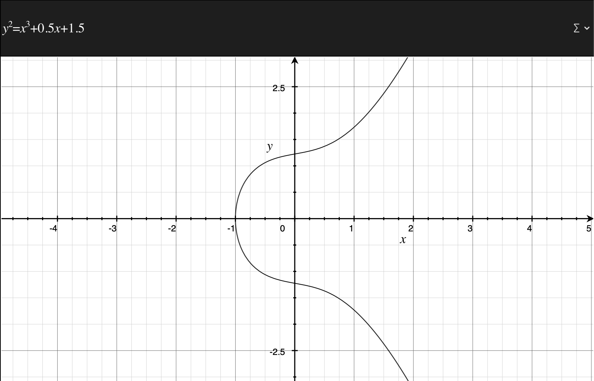

# P2P（ピアツーピア)

## ネットワーク形態


## [UDPホールパンチング](https://ja.wikipedia.org/wiki/UDP%E3%83%9B%E3%83%BC%E3%83%AB%E3%83%91%E3%83%B3%E3%83%81%E3%83%B3%E3%82%B0)

P2P通信を行うための[NAT](https://www.infraexpert.com/study/ip10.html)に穴を開ける処理のこと。
IPで相手と通信するためには、相手のIPアドレスが必要。通常、クライアントはLAN(NATの内側)の中にいるため、直接通信できない。


NATはサーバーからのレスポンスを受け入れるために、一定時間、特定のポートとクライアントを紐づけて覚えている。クライアントと繋がっているNATのIPアドレスとポートが分かれば外部から接続できる。

## [WebRTC](https://ja.wikipedia.org/wiki/WebRTC)

ブラウザでリアルタイム通信を行うためのP2P通信API。WebRTCを使用すればブラウザ同士が直接通信することができる。WebRTCはいくつかの技術が組み合わされて実現されている。

- [SDP](https://developer.mozilla.org/ja/docs/Web/API/WebRTC_API/Connectivity#%E3%82%BB%E3%83%83%E3%82%B7%E3%83%A7%E3%83%B3%E3%83%87%E3%82%A3%E3%82%B9%E3%82%AF%E3%83%AA%E3%83%97%E3%82%B7%E3%83%A7%E3%83%B3)

  P2P 通信を確立するための情報([セッションディスクリプション](https://developer.mozilla.org/ja/docs/Web/API/WebRTC_API/Connectivity#%E3%82%BB%E3%83%83%E3%82%B7%E3%83%A7%E3%83%B3%E3%83%87%E3%82%A3%E3%82%B9%E3%82%AF%E3%83%AA%E3%83%97%E3%82%B7%E3%83%A7%E3%83%B3))をやり取りするプロトコル

- [シグナリング](https://developer.mozilla.org/ja/docs/Web/API/WebRTC_API/Connectivity#%E3%82%B7%E3%82%B0%E3%83%8A%E3%83%AA%E3%83%B3%E3%82%B0)

  P2Pを確立するための情報を交換する

- SRTP 
  
  セキュアなオーディオ・ビデオ用通信プロトコル

- SCTP over DTLS

  データ通信に利用するプロトコル

P2P通信するためにはICEが必要。STANサーバーへ接続してICEを得る。


[手動でWebRTCの通信をつなげよう ーWebRTC入門2016](https://html5experts.jp/mganeko/19814/)

[WebRTC プロトコル入門](https://developer.mozilla.org/ja/docs/Web/API/WebRTC_API/Protocols)

[WebRTC 接続](https://developer.mozilla.org/ja/docs/Web/API/WebRTC_API/Connectivity)

[panda's tech note WebRTC](https://ja.tech.jar.jp/webrtc/basics.html)

[WebRTC コトハジメ](https://gist.github.com/voluntas/67e5a26915751226fdcf)

# ブロックチェーン

- [Bitcoin: A Peer-to-Peer Electronic Cash System](https://bitcoin.org/bitcoin.pdf)

  中央機関が存在しないP2Pネットワーク上で、合意形成を行うことを可能にした技術。

- [ビットコイン論文からさぐる ブロックチェーンのヒント](https://www.ogis-ri.co.jp/otc/hiroba/technical/bitcoinpaper/part1.html)

- [Bitcoin Core integration/staging tree](https://github.com/bitcoin/bitcoin)

- [Blockchain.com](https://www.blockchain.com/explorer)

## ハッシュ

### 簡単なハッシュ

単純な加算を使ったいい加減なハッシュの例。データの並びが変わっても計算結果が変わらないという問題がある。

```typescript
import {TextEncoder} from "util";
const utf8Encode = new TextEncoder();
const array = utf8Encode.encode("Hello World");
const sum = array.reduce((sum, value) => sum + value, 0) & 0xff;
console.log(`0x${sum.toString(16).toUpperCase()}`); // => 0x1C
```

参考：[UTF8 文字コード表 1byte](https://orange-factory.com/sample/utf8/code1.html)

### 暗号化や改ざん防止のためのハッシュ

データの並びや、値が少しでも違うと全く異なる結果になる。

```typescript
import {TextEncoder} from "util";
const utf8Encode = new TextEncoder();
const array = utf8Encode.encode("Hello World");
const hash = crypto.createHash('sha256').update(Buffer.from(array)).digest('hex');
console.log(hash); // => 'a591a6d40bf420404a011733cfb7b190d62c65bf0bcda32b57b277d9ad9f146e'
```

参考：[ハッシュ関数](https://ja.wikipedia.org/wiki/%E3%83%8F%E3%83%83%E3%82%B7%E3%83%A5%E9%96%A2%E6%95%B0)

ビットコインでは SHA-256 を使用する。

## ブロック

ブロックは「ひとつ前のブロックのハッシュ値」と「取引情報」、「ナンス」と呼ばれる32ビットの整数値を含む。


```typescript
// ブロックのイメージ：実際のビットコインとは異なります。
import crypto from "crypto";
import { TextEncoder } from "util";

const utf8Encode = new TextEncoder();
const nance = Number(process.argv[2] || Math.floor(Math.random() * Number.MAX_SAFE_INTEGER));

const block = {
  // ひとつ前のブロックのハッシュ
  prevBlock: "2af7909ca08f18facc556624b02e1a5c683bb0f557137b1ef7e0028fc457715c",
  // タイムスタンプ
  timestamp: "2022-09-03T23:40:16.277Z",
  // 取引データ、一つのブロックに複数保持できる
  transactions: [
    {
      deal: {
        from: "Taro.Yamada", // 誰から
        to: "Kota.Suzuki", // 誰へ
        fee: 0.5, // いくら渡した
      },
    },
  ],
  // ナンス
  nance,
};

const array = utf8Encode.encode(JSON.stringify(block));
const hash = crypto.createHash("sha256").update(Buffer.from(array)).digest("hex");
console.log(`nance: ${nance}`);
console.log(hash);
```

ブロックが同じならハッシュは同じ値になる。

```bash
$ yarn run test:block 7687765275567041
nance: 7687765275567041
15ac6dd604376d69a89aa656f9b3d356dc760791d3ffdb6c3ba3b5fd925efc17
```

ビットコインのハッシュは先頭が0で連続する必要がある。ナンス値を選択して、0が連続するナンスを探す。何ビット連続するかは、ハッシュレートによって変わる。

- ジェネシスブロック

  一番初めのブロックのこと。ビットコインではハードコーディングされている。

- マイニング

  取引情報の正常性を確認して、ナンスをランダムに変えて先頭が0で連続するナンスを探す。
  何ビット連続する必要があるかはハッシュレートによって変わる。

  [実際のブロックの例](https://www.blockchain.com/btc/block/753538)

- ハッシュレート

  ブロックテーンネットワークが持つハッシュの1秒当たりの計算スピード。
  ビットコインの発行スピードを一定に保つためハッシュレートに応じてマイニングの難易度が変わる。

  [ハッシュレートとは？ビットコイン価格との関係性も解説](https://gentosha-go.com/articles/-/43387)

- ノード

  ブロックチェーンを管理するコンピュータ群。ノードはP2Pネットワークを使用して通信する。

- フルノード

  過去の取引データを全て保持しているノード。

- SPVノード

  一部の取引データをダウンロードしてブロックの検証だけを行うノード。

- プルーフ・オブ・ワーク

  ノードはブロックの正常性をチェックし、正しいものだけブロックチェーンに接続する。

## 取引データの確かさの確認

ブロックチェーンを使用するユーザーは、[楕円曲線暗号](https://www.fujitsu.com/downloads/JP/archive/imgjp/jmag/vol50-4/paper06.pdf)(ECC)に基づいたプライベートキーとパブリックキーを持つ。

- ビットコインアドレス

  自分のパブリックキーから生成されたID。ユーザーを識別する口座番号のようなもの。

取引データのハッシュ値を公開鍵で暗号化したデータ(署名)をブロックに含める。

```typescript
// サンプルコード：実際のビットコインとは異なります。
import crypto from "crypto";
import fs from "fs";
import path from "path";

const keys = JSON.parse(
  fs.readFileSync(path.join(__dirname, "sample-keys", "ec-keys.json"), "utf-8")
);

const transaction = {
  // 自分のパブリックキー
  publickKey: keys.public,
  // 取引データ(deal)のハッシュをプライベートキーで暗号化したもの。
  encryptedDealHash: "XXXXX",
  // 署名の対象データ
  deal: {
    from: "*** 自分のビットコインアドレス ***", // 誰から
    to: "*** 相手のビットコインアドレス ***", // 誰へ
    fee: 0.5, // いくら渡した
  },
};

// 取引データをプライベートキーで署名する
const pri = crypto.createPrivateKey({
  key: Buffer.from(keys.private, "hex"),
  format: "der",
  type: "pkcs8",
});

const sign = crypto.createSign("SHA256");
sign.update(JSON.stringify(transaction.deal));
sign.end();
const signature = sign.sign(pri);

console.log(signature.toString("hex"));
```

## ビットコインアドレス


参考：[ビットコイン ウォレットをJavascriptで作ってみよう](https://note.com/strictlyes/n/n5432a4c5bd36)

ビットコインアドレスの例

```bash
1GD89BSmF4dLthZzcvgLdF61UTjecRkyoH
```

次のパブリックキーから生成される

```text
04f2dfa3d70e4f511871bd9e6eb6aff9cd8e158597405a0a7cfe7a50909e1643c004df7c909862ed8b7cf7575b5c73d9ccddfdf2b55aed52bb2a7380573bec8d80
```

パブリックキーは次のプライベートキーから生成される。

```text
1210b49b9e62aa4a3b586f581c4bb065ccbbc4e0bfb57599aa23e04738694752
```

プライベートキーは単なるランダムに生成された巨大な整数だが、ビットコインで使用するためには以下の値より小さい値でなければいけない。

```text
FFFFFFFFFFFFFFFFFFFFFFFFFFFFFFFEBAAEDCE6AF48A03BBFD25E8CD0364140
```

サンプルコード

```typescript
import secureRandom from "secure-random";
import base58 from "bs58";
import { ec } from "elliptic";

const ecdsa = new ec("secp256k1");
const sha256 = require("js-sha256");
const ripemd160 = require("ripemd160");

const max = Buffer.from("FFFFFFFFFFFFFFFFFFFFFFFFFFFFFFFEBAAEDCE6AF48A03BBFD25E8CD0364140", "hex");

let isInvalid = true;
let privateKey;

while (isInvalid) {
  privateKey = secureRandom.randomBuffer(32);
  if (Buffer.compare(max, privateKey) === 1) {
    isInvalid = false;
  }
}

if (privateKey) {
  console.log("Private key: ", privateKey.toString("hex"));

  const keys = ecdsa.keyFromPrivate(privateKey);
  const publicKey = keys.getPublic("hex");
  console.log("Public key: ", publicKey);

  let hash = sha256(Buffer.from(publicKey, "hex"));
  let publicKeyHash = new ripemd160().update(Buffer.from(hash, "hex")).digest();

  const step1 = Buffer.from("00" + publicKeyHash.toString("hex"), "hex");
  const step2 = sha256(step1);
  const step3 = sha256(Buffer.from(step2, "hex"));
  const checksum = step3.substring(0, 8);
  const step4 = step1.toString("hex") + checksum;
  const address = base58.encode(Buffer.from(step4, "hex"));

  console.log("BitCoin Address: " + address);
}
```

実行例

```bash
$ npx ts-node BlockChain/gen-bitcoin-address.ts 
Private key: 1210b49b9e62aa4a3b586f581c4bb065ccbbc4e0bfb57599aa23e04738694752
Public key: 04f2dfa3d70e4f511871bd9e6eb6aff9cd8e158597405a0a7cfe7a50909e1643c004df7c909862ed8b7cf7575b5c73d9ccddfdf2b55aed52bb2a7380573bec8d80
BitCoin Address: 1GD89BSmF4dLthZzcvgLdF61UTjecRkyoH
```

次のサイトで確認

- [TP's Go Bitcoin Tests - Addresses](http://gobittest.appspot.com/Address)

ビットコインアドレスの生成手順

1. 公開鍵を SHA-256 にかけ、RIPEMD-160 して publicKeyHash を生成する
2. publicKeyHash の先頭に 00 を付加
3. 1 を SHA-256 にかける
4. さらに SHA-256 で16進数にして
5. 3 の先頭8文字を checksum として切り取る
6. checksum を1の最後尾に連結
7. 5 をBase 58でエンコード

- [ビットコインおけるトランザクションスクリプトの仕組みとその種類](https://zoom-blc.com/transaction-script)

- [ブロックチェーンの3つの課題とは？〜スケーラビリティ、ファイナリティ、セキュリティ〜](https://trade-log.io/column/575)

# 公開鍵暗号方式

## 基本

秘密鍵(プライベートキー）と公開鍵（パブリックキー)と呼ばれる整数値がある。[公開鍵暗号方式](https://ja.wikipedia.org/wiki/%E5%85%AC%E9%96%8B%E9%8D%B5%E6%9A%97%E5%8F%B7)の特徴は以下の通り。

- 公開鍵は秘密鍵から生成できる。
- 秘密鍵で暗号化したデータは、公開鍵でしか戻せない。
- 公開鍵で暗号化したデータは、秘密鍵でしか戻せない。

## 公開鍵暗号の種類

[あなたの「公開鍵暗号」はPKE? それともPKC?](https://blog.cybozu.io/entry/2021/12/28/080000)

- PKE - Public Key Encryption
  
  秘密にしたいデータを相手に渡す技術

- PKC - Public Key Cryptography
  
  暗号化技術全般のこと。本人確認のための署名を扱う技術を含む。

## 楕円曲線DSA (ECDSA)

[ビットコインでは楕円曲線暗号secp256k1が使われている](https://pebble8888.hatenablog.com/entry/2017/10/08/113201)

次のような[楕円曲線](https://ja.wikipedia.org/wiki/%E6%A5%95%E5%86%86%E6%9B%B2%E7%B7%9A)を利用した加算演算を定義してパブリックキーを生成する。



鍵の生成サンプルコード。

```typescript
// プライベートキーとパブリックキーの生成
import crypto from "crypto";

const { privateKey, publicKey } = crypto.generateKeyPairSync("ec", {
  namedCurve: "secp256k1",
  privateKeyEncoding: {
    type: "pkcs8",
    format: "der",
  },
  publicKeyEncoding: {
    type: "spki",
    format: "der",
  },
});

const keys = {
  private: privateKey.toString("hex"),
  public: publicKey.toString("hex"),
};

console.log(JSON.stringify(keys, null, "  "));
```

```bash
$ npx ts-node BlockChain/generate-ec-keys.ts 
{
  "private": "XXXXX",
  "public": "XXXXX"
}
```

参考：[ASN.1](https://poruruba.github.io/utilities/)

## 署名



データをプライベートキーで暗号化して、データとともに署名されたデータと公開鍵を相手に渡す。


相手は、渡された署名を公開鍵で復号化してデータと一致することを確認する。データが一致すれば、プライベートキーの持ち主が暗号化したことが照明される。

プライベートキーで署名するサンプルコード。

```typescript
// プライベートキーで署名
import crypto from "crypto";
import fs from "fs";
import path from "path";

const keys = JSON.parse(
  fs.readFileSync(path.join(__dirname, "sample-keys", "ec-keys.json"), "utf-8")
);

const pri = crypto.createPrivateKey({
  key: Buffer.from(keys.private, "hex"),
  format: "der",
  type: "pkcs8",
});

const sign = crypto.createSign("SHA256");
sign.update(process.argv[2]);
sign.end();
const signature = sign.sign(pri);

console.log("signature:", signature.toString("hex"));
```

パブリックキーで署名を検証するサンプルコード。

```typescript
// パブリックキーで署名を検証
import crypto from "crypto";
import fs from "fs";
import path from "path";

const keys = JSON.parse(
  fs.readFileSync(path.join(__dirname, "sample-keys", "ec-keys.json"), "utf-8")
);

const pub = crypto.createPublicKey({
  key: Buffer.from(keys.public, "hex"),
  format: "der",
  type: "spki",
});

// 署名の確認
const verify = crypto.createVerify("SHA256");
verify.update(process.argv[2]);
verify.end();
console.log(verify.verify(pub, Buffer.from(process.argv[3], "hex")));
```

```bash
# 署名する
$ npx ts-node BlockChain/ec-sign.ts "Hello World"
signature: 3045022100d5f989426bedc581bd43770e44499adcf3b09b180b2ba5a5e4c1dc44cca003a3022019cce156476945133cbb81c47af265ca6b323a9b4174e19aecc4263d413c2f7c
# 署名を検証する
$ npx ts-node BlockChain/ec-verify.ts "Hello World" 3045022100d5f989426bedc581bd43770e44499adcf3b09b180b2ba5a5e4c1dc44cca003a3022019cce156476945133cbb81c47af265ca6b323a9b4174e19aecc4263d413c2f7c
true
```

# Ethereum

- [イーサリアムへようこそ](https://ethereum.org/ja/)

- [Ethereumとは何か？](https://book.ethereum-jp.net/what_is_ethereum)

  「ブロックチェーン」と呼ばれる技術をベースに、特別な管理者のいないP2Pシステム上で様々なサービスを実現するための基盤、プラットフォーム。経済に特化したビットコインとは性質が全く異なる。

- ワールドコンピュータ

  [イーサリアムとはワールドコンピューターである](https://bittimes.net/news/512.html)

  Ethereum は特定の管理者がいないワールドコンピュータである。世界中のコンピュータをP2Pで繋げ、一つのコンピュータとして動作する。

- DApps

  ワールドコンピュータで動作するアプリのこと。Ethereum上で任意のアプリを動作させることができる。

  - [イーサリアム搭載のツールとサービス](https://ethereum.org/ja/dapps/)

- Gas

  ワールドコンピュータでプログラムを動かすために必要な手数料のこと。ネットワークの混雑度合いによって手数料は変動する。

  - [Ethereum Gas Charts](https://ethereumprice.org/gas/)

- Wei
  
  Gasの単位。1ETHは1wei x 10 の 18乗。

  - [ETH GAS STATION](https://ethgasstation.info/)

- ブロックチェーン

  Ethereum で管理しているデータはブロックチェーンで管理されているため、特定の企業や国が自分の都合に合わせて改ざんすることができない。

- スマートコントラクト

  ブロックチェーンに記録する契約書のこと。Ethereum の契約書はワールドコンピュータで動作するプログラミングされたコード。

- ノード

  [【保存版】Ethereum nodeの３類型の違いを理解しよう！（保持データについて）](https://note.com/standenglish/n/na5006f0b3fd4)

  - ライトノード

    ブロックヘッダのみ持っているノード。

  - フルノード

    全取引データを持っているノードのこと。

  - アーカイブノード

    全取引データに加えステートの情報を持っているノードのこと。

- ハッシュ関数

  イーサリアムでは「[Keccak-256](https://github.com/ethereum/eth-hash)」を使用する。

- ブートストラップノード

  [Ethereumのノード探索の仕組みとエクリプス攻撃とその対策](https://techmedia-think.hatenablog.com/entry/2020/07/17/205522)

  クライアントやノードがP2P接続する前に問い合わせするサーバーのこと。ブートストラップノードはクラウドで動作しており、接続さきはコードに埋め込まれている。

# ブロックチェーンの課題

  [ブロックチェーンの3つの課題とは？〜スケーラビリティ、ファイナリティ、セキュリティ〜](https://trade-log.io/column/575)

- スケーラビリティ
  
  遅い、重い、大きなデータを扱えない

  - 一般的なクレカ：数万トランザクション/秒
  - ビットコイン：7トランザクション/秒
  - イーサリアム：15〜20トランザクション/秒
  - プライベートブロックチェーン：数千トランザクション/秒

  [オンチェーンとオフチェーンを理解しよう](https://pol.techtec.world/blockchain-usecase/kyber-network/onchain-offchain)

- ファイナリティ

  取引内容が覆る可能性がゼロではない。

  [仮想通貨のハードフォークとは？仕組みとおきた時の値動きを徹底解説](https://www.caica.jp/media/crypto/cryptocurrency-hard-fork/)

- セキュリティ
  
  - マシンパワー次第では改竄できる[51%問題](https://bitcoin.dmm.com/glossary/51_percent_attack)がある。
  - 秘密鍵の流出問題、一度流出すると取り戻せない。
